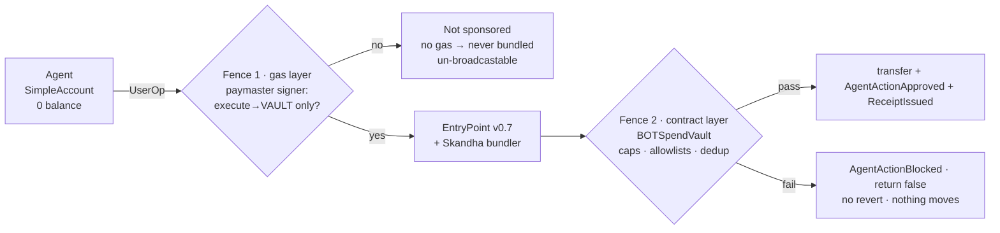
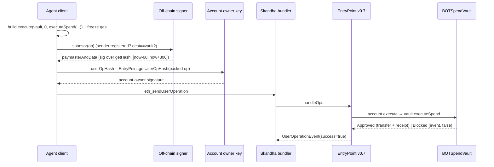

# Architecture

[← README](./README.md) · [Security](./security.md) · [Adversarial Testing](./adversarialtesting.md)

Spenda fences an autonomous agent with **two independent controls** — one at the gas layer
(ERC-4337), one at the contract layer (the vault). Neither substitutes the other.

---

## The two fences



- **Fence 1 (gas)** decides *whether the action can be paid for*. It gates **destination**: the
  off-chain signer only signs a UserOp whose calldata is `execute(dest = vault)` from a registered
  agent account. Off-scope → no signature → no gas → not included.
- **Fence 2 (the vault)** decides *whether value moves*. It gates **policy** and moves value only inside
  it. A blocked action **emits an event and returns `false`** rather than reverting, so every decision is
  a permanent on-chain artifact.

**The seam:** the signer does *not* pre-check spend policy. An over-cap call to the vault **is** sponsored
(it targets the vault), then blocked on-chain by Fence 2 — the paymaster pays gas for that blocked action.
This is a bounded, intentional tradeoff (see [security.md → F6](./security.md#f6--the-paymaster-pays-for-blocked-actions)).

## Components

| Component | Role |
|-----------|------|
| **`BOTSpendVault.sol`** | Fence 2. Holds funds, enforces per-agent policy (active/expiry, token + target allowlists, per-tx cap, rolling-24h daily cap, actionId dedup). ERC20-first (`SafeERC20`) + native path. No-revert-on-policy; hand-rolled reentrancy guard; checks-effects-interactions. |
| **`BOTSpendPaymaster.sol`** | Fence 1. Extends eth-infinitism `BasePaymaster` (v0.7); reproduces `VerifyingPaymaster.getHash`/`parsePaymasterAndData` **verbatim** and adds an immutable-`VAULT` destination gate. Validation is **storage-free** (reads only immutables, empty context). |
| **SimpleAccount + Factory** (v0.7) | The agent's smart account. Holds nothing; only `execute`s. Counterfactual (CREATE2) address is where the vault policy is keyed. |
| **Off-chain signer** (`client/src/signer.ts`) | The sponsor policy. Stateless: `sender ∈ registered accounts` AND `callData` decodes to `execute(dest = vault)` → sign the paymaster `getHash` over a short validity window; else refuse. Never reads vault state. |
| **Agent client** (`client/src`) | Builds UserOps, packs v0.7 fields, computes `getHash`, submits via the bundler. |
| **`MockUSD.sol`** | 6-decimal test stablecoin (no canonical testnet stablecoin exists; a real ERC20 on the live testnet). |

## Address model

The registered "agent" is the **SimpleAccount address**, not its owner EOA.

```
agent owner EOA   ──owns──▶  SimpleAccount (the agent)  ──msg.sender──▶  vault.executeSpend
     │                              │
   signs UserOps               registered in vault policy
   (never holds funds)         registered in signer's sender set
```

Policy, allowlists, and the paymaster's registered-sender set are all keyed on the **SimpleAccount
address**. The owner EOA only signs UserOps. Data is keyed on the agent address throughout, so
multi-agent is a config change, not a refactor.

## UserOp lifecycle (the proven sequence)



Two distinct digests, never crossed: the **signer** signs the paymaster `getHash`; the **account owner**
signs the EntryPoint `userOpHash`.

### Gas fields freeze at signing

`getHash` commits to *all* gas fields — `accountGasLimits`, `preVerificationGas`, `gasFees`, and the
paymaster gas limits. So the client's sequence is **estimate → freeze → sign → submit unchanged**. Any
field touched after signing makes the recovered signer ≠ `verifyingSigner` (silent rejection). The
frontend's server route (`/api/sponsor`) floors `callGasLimit ≥ 250k` because the bundler's per-op
breakdown is unreliable.

## The three replay layers (kept separate)

| Layer | Guards | Mechanism |
|-------|--------|-----------|
| **EntryPoint nonce** | UserOp replay | 2D nonce in the EntryPoint |
| **Paymaster window** | sponsorship replay | `validUntil`/`validAfter` (~5 min: skew 60s, ttl 300s) |
| **Vault actionId** | spend replay | `usedAction[actionId]` dedup |

## EVM & tooling

- `evm_version = cancun` (verified live: PUSH0/MCOPY/TLOAD/TSTORE execute; the canonical v0.7 EntryPoint —
  which uses transient storage — is byte-identical to Ethereum mainnet at the same address on 968).
- Deps: OpenZeppelin 5.x, `@account-abstraction/contracts@0.7.0` (tag), forge-std; solc 0.8.28.

See **[adversarialtesting.md](./adversarialtesting.md)** for how each of these is verified, and
**[security.md](./security.md)** for the guarantees they provide.
